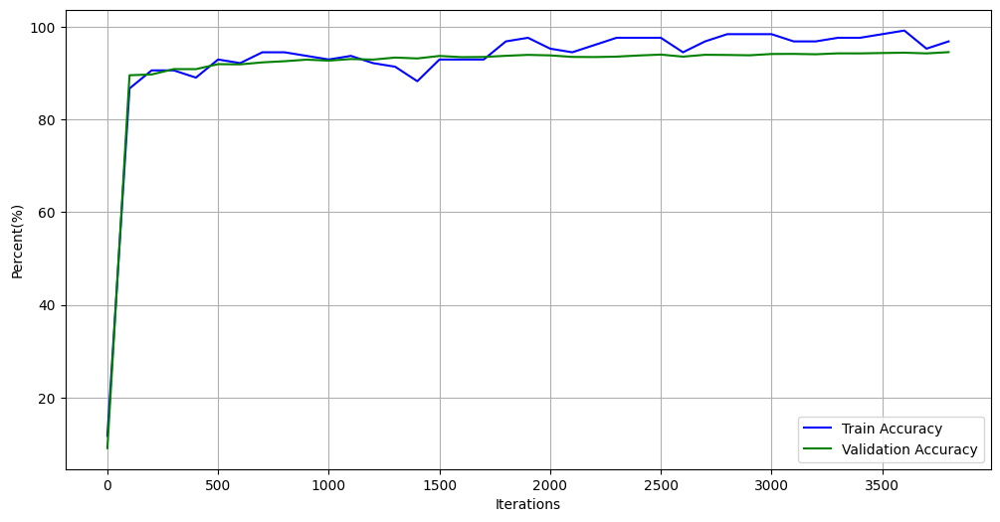

# 第1章 实验目的

通过实现对THUCTC数据集的文本主题分类，理解BERT中多头注意力、掩蔽语言模型（masked language model, MLM）和下一句预测（next sentence predict, NSP）的基本原理和基本的程序实现方法，同时了解BERT中Tokenize、Token Embedding 、 Positional Embedding 和 Segment Embedding等对文本预处理的基本过程。

# 第2章 算法描述和分析

## 2.1 算法背景

2017年Transformer架构横空出世后，被使用在各个深度学习领域中，尤其是NLP领域。在传统seq2seq基础上，其引入注意力机制，解决了传统Encoder-Decoder输出依赖问题。基于Transformer架构和ELMo预训练词表示，后续衍生了基于Transformer Decoder的GPT和基于Transformer Encoder的BERT。Devlin 等在(2018)提出的BERT能够基于其双向上下文表示任何词元该模型，获得了11种NLP任务SOTA的结果，引领了大型预训练语言模型研究热潮。

 

图1 ELMo、GPT和BERT的比较

## 2.2 BERT网络架构

 

图2 BERT 网络模型细节图

如图2 所示，BERT 网络结构整体上就是由多层的 Transformer Encoder 堆叠所形成，只不过在 Input 部分多了一个 Segment Embedding。

在 BERT 中 Input Embedding 模块主要包含三个部分：Token Embedding 、 Positional Embedding 和 Segment Embedding ，BERT 中的Positional Embedding 对于每个位置的编码并不是采用公式计算得到，而是类似普通的词嵌入一样为每一个位置初始化了一个向量，然后随着网络一起训练得到。Segment Embedding 的作用便是用来区分输入序列中的不同部分，其本质就是通过一个普通的词嵌入来区分每一个序列所处的位置。例如在 NSP 任务中，对于任意一个句子（一共两个）来说，其中的每一位置都将用同一个向量来进行表示，以此来区分哪部分字符是第 1 句哪部分字符是第 2 句，即此时 Segment 词表的长度为 2。最后，再将这三部分Embedding后的结果相加（并进行标准化）便得到了最终的 Input Embedding 部分的输出。

最下面的 Input 表示原始的输入序列，其中第一个字符“[CLS]”是一个特殊的分类标志，如果下游任务是本实验这种文本分类的话，那么在BERT 的输出结果中可以只取“[CLS]”对应的向量进行分类即可；而其中的“[SEP]”字符则是用来作为将两句话分开的标志。Segment Embedding 层则同样是用来区分两句话所在的不同位置，对于每句话来说其内部各自的位置向量都是一样的，当然如果原始输入只有一句话，那么 Segment Embedding 层中对应的每个 Token 的位置向量都相同。最后，Positional Embedding 则是用来标识句子中每个 Token 各自所在的位置，使得模型能够捕捉到文本“有序”这一特性。

BertEncoder由多个BertLayer堆叠而成，本实验采用的BERT为base版本，最大只支持512个字符的长度，12个BertLayer，embedding的维度为768，有12个head。

## 2.3 MLM 与 NSP 任务

为了能够更好训练BERT网络，BERT论文作者在BERT的训练过程中引入两个任务，MLM和NSP。对于MLM任务来说，其做法是随机掩盖掉输入序列中15%的Token（即用“[MASK]”替换掉原有的Token），然后在BERT的输出结果中取对应掩盖位置上的向量进行真实值预测。

*In order to train a deep bidirectional representation, we simply mask some percentage of the input tokens at random, and then predict those masked tokens. In this case, the final hidden vectors corresponding to the mask tokens are fed into an output softmax over the vocabulary, as in a standard LM. In all of our experiments, we mask 15% of all WordPiece tokens in each sequence at random.*

接着作者提到，虽然MLM的这种做法能够得到一个很好的预训练模型，但是仍旧存在不足之处。由于在fine-tuning时，由于输入序列中并不存在 “[MASK]”这样的Token，因此这将导致pre-training和fine-tuning之间存在不匹配不一致的问题（GAP）。

*Although this allows us to obtain a bidirec- tional pre-trained model, a downside is that we are creating a mismatch between pre-training and fine-tuning, since the [MASK] token does not ap- pear during fine-tuning.*

为了解决这一问题，作者在原始MLM的基础上做了部分改动，即先选定15% 的Token，然后将其中的80%替换为“[MASK]”、 10%随机替换为其它Token、剩下的10%不变。最后取这15%的Token对应的输出做分类来预测其真实值。

由于很多下游任务需要依赖于分析两句话之间的关系来进行建模，例如问 题回答等。为了使得模型能够具备有这样的能力，作者在论文中又提出了二分类的下句预测任务。

*Many important downstream tasks such as Ques- tion Answering (QA) and Natural Language Infer- ence (NLI) are based on understanding the relationship between two sentences. In order to train a model that understands sentence relationships, we pretrain for a binarized next sen- tence prediction task.*

具体地，对于每个样本来说都是由A和B两句话构成，其中50%的情况B确实为A的下一句话（标签为IsNext），另外的50%的情况是B为语料中其它的随机句子（标签为NotNext），然后模型来预测B是否为A的下一句话。 

Specifically, when choosing the sentences A and B for each pretraining example, 50% of the time B is the actual next sentence that follows A (labeled as IsNext), and 50% of the time it is a random sentence from the corpus (labeled as NotNext)

 

图3 MLM 和 NSP 任务网络结构图

如图3所示便是 MLM 和 NSP 这两个任务在 BERT 预训练时的输入输出示意图，其中最上层输出的 C 在预训练时用于 NSP 中的分类任务；其它位置上的*Ti* , *Tj* *¢* 则用于预测被掩盖的 Token。

## 2.4 文本分类


图4 文本分类示意图

总的来说，基于 BERT的文本分类模型就是在原始的 BERT 模型后再加上一个全连接层。因此只需要将预训练好的BERT模型参数载入，进行微调即可。同时，对于分类层的输入（也就是原始 BERT 的输出），默认情况下取 BERT 输出结果中[CLS]位置对应的向量。

因此，对于基于 BERT 的文本分类模型来说其输入就是 BERT 的输入，输出则是每个类别对应的 logits 值。

# 第3章 程序实现技术技巧的介绍和分析

## 3.1 数据预处理

由于原始THUCTC数据集中每个文本的长度有的大于了BERT的最大字符数512，且为了加速训练速度，本实验只提取了原始数据集中每条新闻的标题。即将其转化了单文本分类问题，对于这个场景来说其输入只有一个序列，所以在构建数据集 的时候并不需要构造 Segment Embedding 的输入，直接默认使用全为 0 即可。为了减少Padding Mask中T的数量，本实验将max_sen_len设置为32。

第 1步需要将原始的数据样本进行tokenize处理，本实验采用的是“字粒度”，对于中文语料来说就是将每个字和标点符号都给切分开，我们可以借用 transformers 包中的 BertTokenizer 方法来完成：

```python
if __name__ == '__main__':
    model_config = ModelConfig()
    tokenizer = BertTokenizer.from_pretrained(model_config.pretrained_model_dir).tokenize
    print(tokenizer("10 年前的今天，纪念 5.12 汶川大地震 10 周年"))
    # ['10', '年', '前', '的', '今', '天', '，', '纪', '念', '5', '.', '12', '汶', '川', '大', '地', '震', '10', '周', '年']
```

第2步再根据 tokenize 后的结果构造一个字典，载入谷歌开源的 vocab.txt词表。

```python
class Vocab:
    UNK = '[UNK]'
    def __init__(self, vocab_path):
        self.stoi = {}
        self.itos = []
        with open(vocab_path, 'r', encoding='utf-8') as f:
            for i, word in enumerate(f):
                w = word.strip('\n')
                self.stoi[w] = i
                self.itos.append(w)

    def __getitem__(self, token):
        return self.stoi.get(token, self.stoi.get(Vocab.UNK))

    def __len__(self):
        return len(self.itos)
```

接着便可以定义一个方法来实例化一个词表：

```python
def build_vocab(vocab_path):
    return Vocab(vocab_path)

if __name__ == '__main__':
    vocab = build_vocab()
```

在经过上述代码处理后，我们便能够通过 vocab.itos 得到一个列表，返回词 表中的每一个词；通过vocab.itos[2]返回得到词表中对应索引位置上的词；通过 vocab.stoi得到一个字典，返回词表中每个词的索引；通过vocab.stoi['月']返回得 到词表中对应词的索引；通过len(vocab)来返回词表的长度。如下是建立后的词表：

```python
{'[PAD]': 0, '[unused1]': 1, '[unused2]': 2, '[unused3]': 3, '[unused4]': 4, 

'[unused5]': 5,'[unused6]': 6, '[unused7]': 7, '[unused8]': 8,'[unused9]': 9, 

 '[unused10]': 10, '[unused11]': 11, '[unused12]': 12, '[unused13]': 13, ...

 '[unused42]': 42, ....'乐': 727, '乒': 728, '乓': 729, '乔': 730, '乖': 731,

 '乗': 732, '乘': 733, '乙': 734, '乜': 735, '九': 736, '乞': 737, '也': 738, 

 '习':739,'乡': 740,'书': 741,'乩': 742,'买': 743, '乱': 744,'乳': 745, ....}
```

第 3 步则是根据字典将 tokenize 后的文本序列转换为 Token 序列，同时在 Token 序列的首尾分别加上[CLS]和[SEP]符号，并进行 Padding。实现代码如下：

```python
def data_process(self, filepath):
    raw_iter = open(filepath, encoding="utf8").readlines()
    data = []
    max_len = 0
    for raw in tqdm(raw_iter, ncols=80):
        line = raw.rstrip("\n").split(self.split_sep)
        s, l = line[0], line[1]
        tmp = [self.CLS_IDX] + [self.vocab[token] for token in self.tokenizer(s)]
        if len(tmp) > self.max_position_embeddings - 1:
            tmp = tmp[:self.max_position_embeddings - 1]
        tmp += [self.SEP_IDX]
        tensor_ = torch.tensor(tmp, dtype=torch.long)
        l = torch.tensor(int(l), dtype=torch.long)

        max_len = max(max_len, tensor_.size(0))
        data.append((tensor_, l))
    return data, max_len
```

在处理完成后，样本将会被转换成类似如下形式：

```python
tensor([[101, 1283, 674, 679, 6206, 744, 4509, 6435, 5381,.., 0,  0],

     [101, 8108, 2399, 1184, 4638, 791, 2399, 8024, 5279,.., 0,  0],

     [101, 2582, 720, 4692, 2521, 3342, 3675, 1762, 671,..,8043, 102],

     [101, 2785, 2128, 2025, 4374, 1964, 4638, 6756, 1730,.., 0,  0]])

 torch.Size([39, 4])
```

101 就是[CLS]在词表中的索引位置，102 则是 [SEP]在词表中的索引；其它非 0 就是 tokenize 后的文本序列转换成的 Token 序列。

第 4 步则是根据第 3 步处理后的结果生成对应的 Padding Mask 向量：

```python
def pad_sequence(sequences, batch_first=False, max_len=None, padding_value=0):
    if max_len is None:
        max_len = max([s.size(0) for s in sequences])
    out_tensors = []
    for tensor in sequences:
        if tensor.size(0) < max_len:
            tensor = torch.cat([tensor, torch.tensor([padding_value] * (max_len - tensor.size(0)))], dim=0)
        else:
            tensor = tensor[:max_len]
        out_tensors.append(tensor)
    out_tensors = torch.stack(out_tensors, dim=1)
    if batch_first:
        return out_tensors.transpose(0, 1)
    return out_tensors
```

第 5 步为构造DataLoader 迭代器：

```python
def load_train_val_test_data(self, train_file_path=None,
                             val_file_path=None,
                             test_file_path=None,
                             only_test=False):
    test_data, _ = self.data_process(test_file_path)

    test_iter = DataLoader(test_data, batch_size=self.batch_size,
                           shuffle=False,
                           collate_fn=self.generate_batch)
    if only_test:
        return test_iter
    train_data, max_sen_len = self.data_process(train_file_path)
    if self.max_sen_len == 'same':
        self.max_sen_len = max_sen_len
    val_data, _ = self.data_process(val_file_path)
    train_iter = DataLoader(train_data, batch_size=self.batch_size,
                            shuffle=self.is_sample_shuffle,  collate_fn=self.generate_batch)
    val_iter = DataLoader(val_data, batch_size=self.batch_size,
                          shuffle=False, collate_fn=self.generate_batch)
    return train_iter, test_iter, val_iter
```

执行完上述代码后输入文本转化为了如下向量：

```python
 torch.Size([39, 4])
 tensor([[ 101, 1283, 674, 679, 6206, ... 7028, 102, ... ,0,  0,  0],...])
 tensor([[False, False, False,False,False, ..., False,... True, True, True],...])
 tensor([ 4,...])  
```


## 3.2 载入预训练模型参数

单文本分类任务在BERT后只多加了一个全连接层，因此可以载入BERT部分预训练好的参数，在新的数据集上进行迁移学习。

```python
def from_pretrained(cls, config, pretrained_model_dir=None):
    model = cls(config)
    pretrained_model_path = os.path.join(pretrained_model_dir, "pytorch_model.bin")
    loaded_paras = torch.load(pretrained_model_path)
    state_dict = deepcopy(model.state_dict())
    loaded_paras_names = list(loaded_paras.keys())[:-8]
    model_paras_names = list(state_dict.keys())[1:]
    for i in range(len(loaded_paras_names)):
        state_dict[model_paras_names[i]] = loaded_paras[loaded_paras_names[i]]
        logging.info(f"成功将参数{loaded_paras_names[i]}赋值给{model_paras_names[i]}")
    model.load_state_dict(state_dict)
    return model

```

## 3.3 前向传播

```python
class BertForSentenceClassification(nn.Module):
    def __init__(self, config, pretrained_model_dir=None):
        super(BertForSentenceClassification, self).__init__()
        self.num_labels = config.num_labels
        if pretrained_model_dir is not None:
            self.bert = BertModel.from_pretrained(config, pretrained_model_dir)
        else:
            self.bert = BertModel(config)
        self.dropout = nn.Dropout(config.hidden_dropout_prob)
        self.classifier = nn.Linear(config.hidden_size, self.num_labels)

    def forward(self, input_ids,  # [src_len, batch_size]
                attention_mask=None,  # [batch_size, src_len]
                token_type_ids=None,  # [src_len, batch_size]
                position_ids=None,  # [1, src_len]
                labels=None):  # [batch_size,]
        pooled_output, _ = self.bert(input_ids=input_ids,
                                     attention_mask=attention_mask,
                                     token_type_ids=token_type_ids,
                                     position_ids=position_ids)
        pooled_output = self.dropout(pooled_output)
        logits = self.classifier(pooled_output)  # [batch_size, num_label]
        if labels is not None:
            loss_fct = nn.CrossEntropyLoss()
            loss = loss_fct(logits.view(-1, self.num_labels), labels.view(-1))
            return loss, logits
        else:
            return logits
```

在上述代码中，第 4 行代码分别就是用来指定模型配置和预训练模型的路径；第 7-10 行代码则是用来定义一个 BERT 模型，可以看到如果预训练模型的路径 存在则会返回一个由 bert-base-chinese 参数初始化后的 BERT 模型，否则则会返 回一个随机初始化参数的 BERT 模型；第 12 行则是定义最后的分类层。第17-20行返回的是原始 BERT 网络的输出，其中 pooled_output 为 BERT第 1 个位置的向量经过一个全连接层后的结果，第 2 个参 数是 BERT 中所有位置的向量；第 21-22 行便是用来进行文本分类的分类层；第23-28行则是用来判断返回损失值还是返回 logits 值。

## 3.4 模型训练

需要再定义一个 train()函数来完成模型的训练，代码如下：

```python
def train(config, model, train_iter, dev_iter, test_iter):
    start_time = time.time()
    model.train()
    param_optimizer = list(model.named_parameters())
    no_decay = ['bias', 'LayerNorm.bias', 'LayerNorm.weight']
    optimizer_grouped_parameters = [
        {'params': [p for n, p in param_optimizer if not any(nd in n for nd in no_decay)], 'weight_decay': 0.01},
        {'params': [p for n, p in param_optimizer if any(nd in n for nd in no_decay)], 'weight_decay': 0.0}]
    # optimizer = torch.optim.Adam(model.parameters(), lr=config.learning_rate)
    optimizer = BertAdam(optimizer_grouped_parameters,
                         lr=config.learning_rate,
                         warmup=0.05,
                         t_total=len(train_iter) * config.num_epochs)
    total_batch = 0  # 记录进行到多少batch
    dev_best_loss = float('inf')
    last_improve = 0  # 记录上次验证集loss下降的batch数
    flag = False  # 记录是否很久没有效果提升
    model.train()
    for epoch in range(config.num_epochs):
        print('Epoch [{}/{}]'.format(epoch + 1, config.num_epochs))
        for i, (trains, labels) in enumerate(train_iter):
            outputs = model(trains)
            model.zero_grad()
            loss = F.cross_entropy(outputs, labels)
            loss.backward()
            optimizer.step()
            if total_batch % 100 == 0:
                # 每多少轮输出在训练集和验证集上的效果
                true = labels.data.cpu()
                predic = torch.max(outputs.data, 1)[1].cpu()
                train_acc = metrics.accuracy_score(true, predic)
                dev_acc, dev_loss = evaluate(config, model, dev_iter)
                if dev_loss < dev_best_loss:
                    dev_best_loss = dev_loss
                    torch.save(model.state_dict(), config.save_path)
                    improve = '*'
                    last_improve = total_batch
                else:
                    improve = ''
                time_dif = get_time_dif(start_time)
                msg = 'Iter: {0:>6},  Train Loss: {1:>5.2},  Train Acc: {2:>6.2%},  Val Loss: {3:>5.2},  Val Acc: {4:>6.2%},  Time: {5} {6}'
                print(msg.format(total_batch, loss.item(), train_acc, dev_loss, dev_acc, time_dif, improve))
                model.train()
            total_batch += 1
            if total_batch - last_improve > config.require_improvement:
                # 验证集loss超过1000batch没下降，结束训练
                print("No optimization for a long time, auto-stopping...")
                flag = True
                break
        if flag:
            break
    test(config, model, test_iter)
```

其中，test为定义的测试函数：

```python
def test(config, model, test_iter):
    # test
    model.load_state_dict(torch.load(config.save_path))
    model.eval()
    start_time = time.time()
    test_acc, test_loss, test_report, test_confusion = evaluate(config, model, test_iter, test=True)
    msg = 'Test Loss: {0:>5.2},  Test Acc: {1:>6.2%}'
    print(msg.format(test_loss, test_acc))
    print("Precision, Recall and F1-Score...")
    print(test_report)
    print("Confusion Matrix...")
    print(test_confusion)
    time_dif = get_time_dif(start_time)
    print("Time usage:", time_dif)


def evaluate(config, model, data_iter, test=False):
    model.eval()
    loss_total = 0
    predict_all = np.array([], dtype=int)
    labels_all = np.array([], dtype=int)
    with torch.no_grad():
        for texts, labels in data_iter:
            outputs = model(texts)
            loss = F.cross_entropy(outputs, labels)
            loss_total += loss
            labels = labels.data.cpu().numpy()
            predic = torch.max(outputs.data, 1)[1].cpu().numpy()
            labels_all = np.append(labels_all, labels)
            predict_all = np.append(predict_all, predic)

    acc = metrics.accuracy_score(labels_all, predict_all)
    if test:
        report = metrics.classification_report(labels_all, predict_all, target_names=config.class_list, digits=4)
        confusion = metrics.confusion_matrix(labels_all, predict_all)
        return acc, loss_total / len(data_iter), report, confusion
    return acc, loss_total / len(data_iter)
```

上述代码的17-37行在训练结束时调用sklearn库打印了训练的宏平均和微平均的分类Accuracy、Precision、Recall和F1-Value。


# 第4章 实验结果、结果分析和实验结论

在一块3090的云服务器（Ubuntu20.04）上完成训练，超参数设置为：epoch=3，batch_size = 128，pad_size = 32，learning_rate = 5e-5。三轮训练完成大约需要20分钟。

```python
(base) root@I16c26565b5004012f8:~/project/Bert-Chinese-Text-Classification-Pytorch# python run.py --model bert
Loading data...
180000it [00:21, 8557.04it/s]
10000it [00:01, 8901.53it/s]
10000it [00:01, 9040.17it/s]
Time usage: 0:00:23
Epoch [1/3]
/root/project/Bert-Chinese-Text-Classification-Pytorch/pytorch_pretrained/optimization.py:275: UserWarning: This overload of add_ is deprecated:
        add_(Number alpha, Tensor other)
Consider using one of the following signatures instead:
        add_(Tensor other, *, Number alpha) (Triggered internally at ../torch/csrc/utils/python_arg_parser.cpp:1485.)
  next_m.mul_(beta1).add_(1 - beta1, grad)
Iter:      0,  Train Loss:   2.4,  Train Acc: 11.72%,  Val Loss:   2.4,  Val Acc:  9.08%,  Time: 0:00:06 *
Iter:    100,  Train Loss:   0.4,  Train Acc: 86.72%,  Val Loss:  0.36,  Val Acc: 89.57%,  Time: 0:00:37 *
Iter:    200,  Train Loss:  0.31,  Train Acc: 90.62%,  Val Loss:  0.34,  Val Acc: 89.74%,  Time: 0:01:06 *
Iter:    300,  Train Loss:  0.31,  Train Acc: 90.62%,  Val Loss:  0.31,  Val Acc: 90.90%,  Time: 0:01:36 *
Iter:    400,  Train Loss:   0.4,  Train Acc: 89.06%,  Val Loss:  0.29,  Val Acc: 90.89%,  Time: 0:02:06 *
Iter:    500,  Train Loss:  0.21,  Train Acc: 92.97%,  Val Loss:  0.26,  Val Acc: 91.97%,  Time: 0:02:35 *
Iter:    600,  Train Loss:  0.25,  Train Acc: 92.19%,  Val Loss:  0.26,  Val Acc: 91.92%,  Time: 0:03:04 
Iter:    700,  Train Loss:  0.23,  Train Acc: 94.53%,  Val Loss:  0.24,  Val Acc: 92.35%,  Time: 0:03:34 *
Iter:    800,  Train Loss:   0.2,  Train Acc: 94.53%,  Val Loss:  0.23,  Val Acc: 92.60%,  Time: 0:04:04 *
Iter:    900,  Train Loss:  0.21,  Train Acc: 93.75%,  Val Loss:  0.22,  Val Acc: 92.94%,  Time: 0:04:33 *
Iter:   1000,  Train Loss:  0.16,  Train Acc: 92.97%,  Val Loss:  0.23,  Val Acc: 92.73%,  Time: 0:05:02 
Iter:   1100,  Train Loss:  0.18,  Train Acc: 93.75%,  Val Loss:  0.21,  Val Acc: 93.07%,  Time: 0:05:32 *
Iter:   1200,  Train Loss:  0.21,  Train Acc: 92.19%,  Val Loss:  0.21,  Val Acc: 92.95%,  Time: 0:06:01 
Iter:   1300,  Train Loss:  0.24,  Train Acc: 91.41%,  Val Loss:   0.2,  Val Acc: 93.39%,  Time: 0:06:31 *
Iter:   1400,  Train Loss:  0.33,  Train Acc: 88.28%,  Val Loss:  0.21,  Val Acc: 93.20%,  Time: 0:07:00 
Epoch [2/3]
Iter:   1500,  Train Loss:  0.18,  Train Acc: 92.97%,  Val Loss:  0.19,  Val Acc: 93.74%,  Time: 0:07:30 *
Iter:   1600,  Train Loss:  0.18,  Train Acc: 92.97%,  Val Loss:   0.2,  Val Acc: 93.48%,  Time: 0:08:00 
Iter:   1700,  Train Loss:  0.22,  Train Acc: 92.97%,  Val Loss:   0.2,  Val Acc: 93.52%,  Time: 0:08:29 
Iter:   1800,  Train Loss:  0.12,  Train Acc: 96.88%,  Val Loss:   0.2,  Val Acc: 93.77%,  Time: 0:08:58 
Iter:   1900,  Train Loss:  0.11,  Train Acc: 97.66%,  Val Loss:  0.19,  Val Acc: 93.97%,  Time: 0:09:28 *
Iter:   2000,  Train Loss:  0.13,  Train Acc: 95.31%,  Val Loss:   0.2,  Val Acc: 93.86%,  Time: 0:09:57 
Iter:   2100,  Train Loss:  0.18,  Train Acc: 94.53%,  Val Loss:   0.2,  Val Acc: 93.53%,  Time: 0:10:26 
Iter:   2200,  Train Loss:  0.14,  Train Acc: 96.09%,  Val Loss:  0.21,  Val Acc: 93.50%,  Time: 0:10:55 
Iter:   2300,  Train Loss:  0.12,  Train Acc: 97.66%,  Val Loss:   0.2,  Val Acc: 93.59%,  Time: 0:11:24 
Iter:   2400,  Train Loss:  0.07,  Train Acc: 97.66%,  Val Loss:   0.2,  Val Acc: 93.84%,  Time: 0:11:54 
Iter:   2500,  Train Loss:  0.11,  Train Acc: 97.66%,  Val Loss:  0.19,  Val Acc: 94.03%,  Time: 0:12:23 
Iter:   2600,  Train Loss:  0.12,  Train Acc: 94.53%,  Val Loss:  0.19,  Val Acc: 93.59%,  Time: 0:12:52 
Iter:   2700,  Train Loss: 0.097,  Train Acc: 96.88%,  Val Loss:  0.19,  Val Acc: 93.99%,  Time: 0:13:21 *
Iter:   2800,  Train Loss:  0.09,  Train Acc: 98.44%,  Val Loss:  0.19,  Val Acc: 93.95%,  Time: 0:13:51 *
Epoch [3/3]
Iter:   2900,  Train Loss:   0.1,  Train Acc: 98.44%,  Val Loss:  0.19,  Val Acc: 93.88%,  Time: 0:14:20 
Iter:   3000,  Train Loss: 0.079,  Train Acc: 98.44%,  Val Loss:  0.19,  Val Acc: 94.16%,  Time: 0:14:50 
Iter:   3100,  Train Loss:  0.08,  Train Acc: 96.88%,  Val Loss:  0.19,  Val Acc: 94.18%,  Time: 0:15:18 
Iter:   3200,  Train Loss:  0.15,  Train Acc: 96.88%,  Val Loss:   0.2,  Val Acc: 94.10%,  Time: 0:15:48 
Iter:   3300,  Train Loss: 0.065,  Train Acc: 97.66%,  Val Loss:  0.19,  Val Acc: 94.30%,  Time: 0:16:17 
Iter:   3400,  Train Loss: 0.048,  Train Acc: 97.66%,  Val Loss:   0.2,  Val Acc: 94.29%,  Time: 0:16:46 
Iter:   3500,  Train Loss: 0.055,  Train Acc: 98.44%,  Val Loss:   0.2,  Val Acc: 94.37%,  Time: 0:17:15 
Iter:   3600,  Train Loss: 0.018,  Train Acc: 99.22%,  Val Loss:  0.19,  Val Acc: 94.44%,  Time: 0:17:44 
Iter:   3700,  Train Loss:   0.1,  Train Acc: 95.31%,  Val Loss:   0.2,  Val Acc: 94.29%,  Time: 0:18:13 
Iter:   3800,  Train Loss: 0.071,  Train Acc: 96.88%,  Val Loss:  0.19,  Val Acc: 94.56%,  Time: 0:18:42 
No optimization for a long time, auto-stopping...
Test Loss:  0.18,  Test Acc: 94.45%
Precision, Recall and F1-Score...
              precision    recall  f1-score   support

          财经     0.9279    0.9400    0.9339      1000
          房产     0.9522    0.9570    0.9546      1000
          股票     0.9105    0.9160    0.9133      1000
          教育     0.9614    0.9720    0.9667      1000
          科技     0.8887    0.9260    0.9070      1000
          社会     0.9517    0.9260    0.9387      1000
          时政     0.9315    0.9240    0.9277      1000
          体育     0.9870    0.9850    0.9860      1000
          游戏     0.9810    0.9310    0.9554      1000
          娱乐     0.9575    0.9680    0.9627      1000

    accuracy                         0.9445     10000
   macro avg     0.9449    0.9445    0.9446     10000
weighted avg     0.9449    0.9445    0.9446     10000

Confusion Matrix...
[[940   9  33   1   6   3   6   1   1   0]
 [ 11 957   7   2   5   6   9   0   0   3]
 [ 39  14 916   1  13   1  14   1   0   1]
 [  3   0   0 972   4   8   7   0   0   6]
 [  2   3  19   4 926   9  12   2  15   8]
 [  7   9   1  13  11 926  19   0   0  14]
 [  7   4  26  11  12  12 924   1   1   2]
 [  2   3   2   0   1   2   1 985   0   4]
 [  0   2   1   0  54   4   0   3 931   5]
 [  2   4   1   7  10   2   0   5   1 968]]
Time usage: 0:00:05
```

 

图5 训练和验证损失

计算最终的评估指标时，将每类文本的1000条作为测试集（非训练集），并打印了混淆矩阵。结果中可以看出，BERT强大的表征能力使得结果普遍很高。特别是体育类新闻的准确率普遍较高，可能是BERT的MLM 和 NSP两个预训练任务使得它能够准确识别体育类的专有名词，包括人物、地点、运动种类等。

# 第5章 小结

通过这个实验，我利用当下最流行、也是效果最好的的预训练语言模型完成了自然语言处理的基本任务文本分类，体会了大模型的强大。但是经过资料查询也得知，其实现在NLP的发展主要是生成式大模型（only decoder），以BERT为代表的only encoder的判别式模型已经渐渐失去了科研界和工业界的关注。而如今的生成式任务也不再局限于文本生成，以midjourney，stable diffusion为代表的AI画图大模型也在冲击着传统的美工。所以以文本分类为引，我认识到未来必然是属于人工智能的时代，也是大模型的时代。

 

 

# 参考文献

[1]Peters, Matthew , et al. "Deep Contextualized Word Representations." (2018).

[2]Vaswani A , Shazeer N , Parmar N ,et al.Attention Is All You Need[J].arXiv, 2017.DOI:10.48550/arXiv.1706.03762.

[3]Devlin, Jacob , et al. "BERT: Pre-training of Deep Bidirectional Transformers for Language Understanding." (2018).

 
